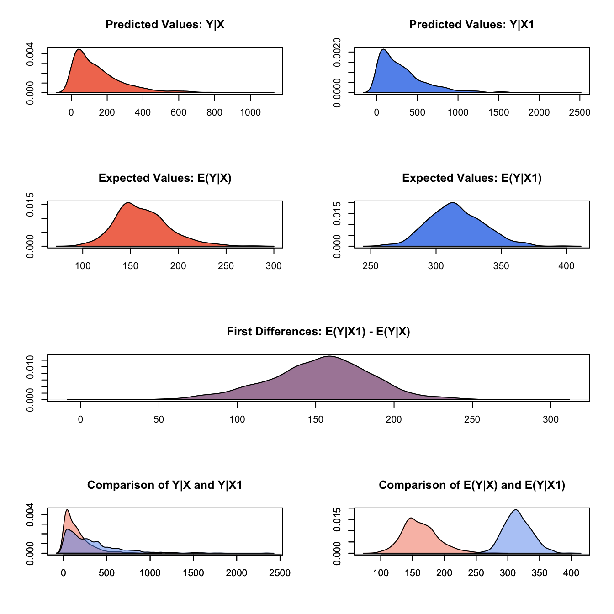

```{r setup, include=FALSE}
knitr::opts_chunk$set(echo = TRUE)
```

## Assignment

In this homework, you will use your own data set to conduct a statistical analysis of your own choice. Make sure to meet the following criteria:

1.  Describe the data in a quantitative and qualitative way; i.e., summarize statistics on the shape of the data, along with a translation of these statistics for a business audience.

2.  Report on the number of observations, the number of variables, the qualitative (categorical) variables, and the quantitative (numeric) variables

3.  A further report on analysis of any single variable, including measures of central tendency (mean, median, mode) and dispersion (range, variance, standard deviation)

4.  Produce appropriate visualizations of your results.

5.  You may carry out this analysis for any number of single variables.

## Introduction

Organ donation remains a serious medical concern since there is a general acute shortage of organ donors, and people in need of a new organ often remain on waiting lists for long periods of times before a suitable donated organ can be found. Blood type is an important factor when it comes to organ transplants. Blood type AB, for example, is known as a universal recipient, since they can accept donor organs from all other blood types, though AB donors are limited to AB recipients only. Conversely, blood type O is considered a universal donor since it lacks the antigens of the other types -- organs from Type-O can be accepted by someone with any blood type, but Type-O recipients can only accept from Type-O donors. Therefore, one can reasonably assume that people with Type O blood types will have the longest wait times on the liver transplant list, regardless of final disposition. Likewise, we might expect type AB to have the shortest wait times on the liver transplant list.

## Data

This dataset is part of the survival package and describes subjects on a liver transplant waiting list from 1990-1999. There are 815 observations, and 6 variables: age in addition to the waiting list, sex, blood type, year they entered the waiting list, time from entering the waiting list, and final disposition. The options for disposition are: received a transplant, died while waiting, withdrew from the list, or are still waiting (censored).

The exponential regression model allows for censorship. In this model, the dependent variable is the number of days spent on the organ transplant waiting list, represented by *futime*. The variable *event* represents the final disposition of the patient, which has 4 categories including censored. Ultimately, we are interested in wait time regardless of the outcome, so the died while waiting, withdrew from the list, or received a transplant can serve as a \"no longer waiting\" category, while still waiting refers to those in the \'censored\' variable.

# 
Results

```         
library(dplyr)
```

```         
## Warning: package 'dplyr' was built under R version 3.4.4
```

```         
library(Zelig)
library(ZeligChoice)
library(faraway)
library(survival)
data(transplant)
tibble::glimpse(transplant)
```

```         
## Observations: 815
## Variables: 6
## $ age    <dbl> 47, 55, 52, 40, 70, 66, 41, 55, 50, 61, 58, 61, 38, 37,...
## $ sex    <fct> m, m, m, f, m, f, f, m, m, m, m, m, f, m, f, m, m, f, f...
## $ abo    <fct> B, A, B, O, O, O, A, O, A, A, A, A, O, O, B, B, O, A, A...
## $ year   <dbl> 1994, 1991, 1996, 1995, 1996, 1996, 1998, 1998, 1990, 1...
## $ futime <dbl> 1197, 28, 85, 231, 1271, 58, 392, 30, 12, 139, 9, 451, ...
## $ event  <fct> death, ltx, ltx, ltx, censored, ltx, ltx, ltx, ltx, ltx...
```

```         
str(transplant)
```

```         
## 'data.frame':    815 obs. of  6 variables:
##  $ age   : num  47 55 52 40 70 66 41 55 50 61 ...
##  $ sex   : Factor w/ 2 levels "m","f": 1 1 1 2 1 2 2 1 1 1 ...
##  $ abo   : Factor w/ 4 levels "A","B","AB","O": 2 1 2 4 4 4 1 4 1 1 ...
##  $ year  : num  1994 1991 1996 1995 1996 ...
##  $ futime: num  1197 28 85 231 1271 ...
##  $ event : Factor w/ 4 levels "censored","death",..: 2 3 3 3 1 3 3 3 3 3 ...
```

```         
summary(transplant)
```

```         
##       age        sex     abo           year          futime      
##  Min.   :17.00   m:447   A :325   Min.   :1990   Min.   :   0.0  
##  1st Qu.:44.00   f:368   B :103   1st Qu.:1993   1st Qu.:  50.0  
##  Median :52.00           AB: 41   Median :1995   Median : 128.0  
##  Mean   :50.52           O :346   Mean   :1995   Mean   : 213.6  
##  3rd Qu.:58.00                    3rd Qu.:1997   3rd Qu.: 276.5  
##  Max.   :72.00                    Max.   :1999   Max.   :2055.0  
##  NA's   :18                                                      
##       event    
##  censored: 76  
##  death   : 66  
##  ltx     :636  
##  withdraw: 37  
##                
##                
## 
```

```         
transplant$evcode[transplant$event=="death"] <- "2"
transplant$evcode[transplant$event=="ltx"] <- "1"
transplant$evcode[transplant$event=="withdraw"] <- "1"
transplant$evcode[transplant$event=="censored"] <- "1"
transplant$evcode <- factor(transplant$evcode)
head(transplant)
```

```         
##   age sex abo year futime    event evcode
## 1  47   m   B 1994   1197    death      2
## 2  55   m   A 1991     28      ltx      1
## 3  52   m   B 1996     85      ltx      1
## 4  40   f   O 1995    231      ltx      1
## 5  70   m   O 1996   1271 censored      1
## 6  66   f   O 1996     58      ltx      1
```

```         
str(transplant)
```

```         
## 'data.frame':    815 obs. of  7 variables:
##  $ age   : num  47 55 52 40 70 66 41 55 50 61 ...
##  $ sex   : Factor w/ 2 levels "m","f": 1 1 1 2 1 2 2 1 1 1 ...
##  $ abo   : Factor w/ 4 levels "A","B","AB","O": 2 1 2 4 4 4 1 4 1 1 ...
##  $ year  : num  1994 1991 1996 1995 1996 ...
##  $ futime: num  1197 28 85 231 1271 ...
##  $ event : Factor w/ 4 levels "censored","death",..: 2 3 3 3 1 3 3 3 3 3 ...
##  $ evcode: Factor w/ 2 levels "1","2": 2 1 1 1 1 1 1 1 1 1 ...
```

```         
head(transplant)
```

```         
##   age sex abo year futime    event evcode
## 1  47   m   B 1994   1197    death      2
## 2  55   m   A 1991     28      ltx      1
## 3  52   m   B 1996     85      ltx      1
## 4  40   f   O 1995    231      ltx      1
## 5  70   m   O 1996   1271 censored      1
## 6  66   f   O 1996     58      ltx      1
```

```         
transplant <- transplant %>%
  mutate(futime = as.integer(futime+1)) %>% 
  mutate(evcode = as.integer(sjmisc::rec(evcode, rec = "2=0; 1=1"))) %>% 
  select(futime, evcode, everything())
```

```         
## Warning: package 'bindrcpp' was built under R version 3.4.4
```

```         
head(transplant)
```

```         
##   futime evcode age sex abo year    event
## 1   1198      0  47   m   B 1994    death
## 2     29      1  55   m   A 1991      ltx
## 3     86      1  52   m   B 1996      ltx
## 4    232      1  40   f   O 1995      ltx
## 5   1272      1  70   m   O 1996 censored
## 6     59      1  66   f   O 1996      ltx
```

Recoding *futime* and new variable *evcode* as integers. Added the *+1* in the *futime* mutation because my time value included a zero entry, which made the *surv* formula not work. I\'m pretty sure there is a better solution out there for eliminating the observations with a 0 in the futime column, but this was a quick/cheap way to fix it that doesn\'t affect the rest of the data too much.

```         
z.exp <- zelig(Surv(futime, evcode) ~ age + sex + abo,
               model = "exp", data = transplant, cite = F)
summary(z.exp)
```

```         
## Model: 
## 
## Call:
## z5$zelig(formula = Surv(futime, evcode) ~ age + sex + abo, data = transplant)
##                Value Std. Error      z         p
## (Intercept)  4.95314    0.20195 24.526 7.76e-133
## age          0.00457    0.00379  1.205  2.28e-01
## sexf        -0.07811    0.07450 -1.048  2.94e-01
## aboB         0.32649    0.11946  2.733  6.28e-03
## aboAB       -0.10573    0.17437 -0.606  5.44e-01
## aboO         0.56767    0.08177  6.942  3.86e-12
## 
## Scale fixed at 1 
## 
## Exponential distribution
## Loglik(model)= -4693.6   Loglik(intercept only)= -4721.1
##  Chisq= 54.95 on 5 degrees of freedom, p= 1.3e-10 
## Number of Newton-Raphson Iterations: 5 
## n=797 (18 observations deleted due to missingness)
## 
## Next step: Use 'setx' method
```

```         
x.low <- setx(z.exp, abo = "AB")
x.high <- setx(z.exp, abo = "O")
s.out <- sim(z.exp, x = x.low, x1 = x.high)
summary(s.out)
```

```         
## 
##  sim x :
##  -----
## ev
##      mean       sd      50%     2.5%    97.5%
## 1 162.362 27.91202 159.5818 114.0414 226.4184
## pv
##          mean       sd      50%     2.5%    97.5%
## [1,] 155.1781 150.6581 114.7674 3.715012 584.3541
## 
##  sim x1 :
##  -----
## ev
##       mean       sd      50%     2.5%    97.5%
## 1 315.3864 20.90255 313.9083 278.7506 360.2394
## pv
##          mean      sd      50%     2.5%    97.5%
## [1,] 318.0286 306.839 238.0688 6.408346 1133.942
## fd
##       mean       sd      50%     2.5%   97.5%
## 1 153.0244 33.49507 155.5817 82.22952 215.316
```

```         
s.out$graph()
```



Looking at the expected value and predicted value of waiting list time between blood type AB and type O, we see a longer duration for type O. The mean wait time for type AB is about 147 days, while type O has a mean of 308 days -- it\'s close to double the duration

```         
s.out$get_qi(xvalue="x1",qi="fd")%>%
  data.frame()%>%
  summary()
```

```         
##        X1        
##  Min.   : 12.53  
##  1st Qu.:133.53  
##  Median :155.58  
##  Mean   :153.02  
##  3rd Qu.:174.75  
##  Max.   :291.15
```

The graphs are truly the most impressive means of communicating this information, but the numbers also tell the story pretty well. Looking at the mean expected value and interquartile Range for first difference between type AB and O, we can see a pretty huge range. Blood type O seems to be a real disadvantage on the liver transplant waiting list, lingering on the list between 45 and 264 days longerb than type AB. To put it in greater perspective, the minimum is about a month and half, and the max is close to 9 months!

# **Discussion**

The dataset documentation makes it clear that the way that people move up and down along the transplant list has changed a lot since the 90s, and now accounts for other factors like how sick a person is and how much they need the transplant for survival. The shortage of available organs for transplant is still quite a big deal, however, so it\'s still important to educate people about organ donation -- and if this data is anything to go by, the greatest impact would be to focus on encouraging people with blood type O to become organ donors.
